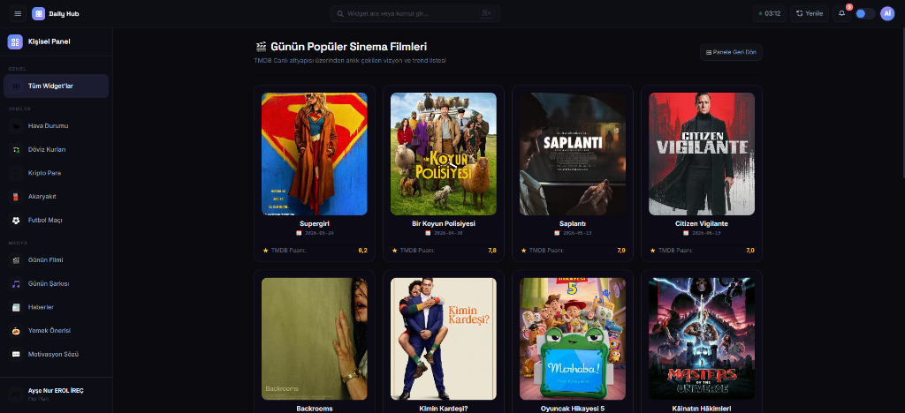
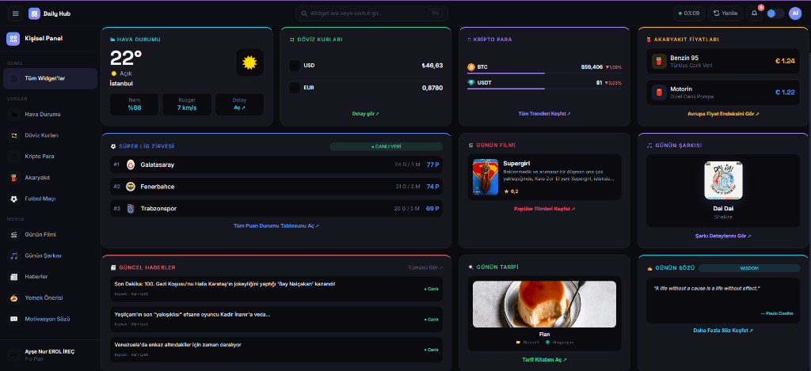
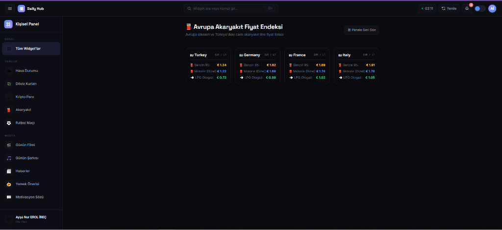
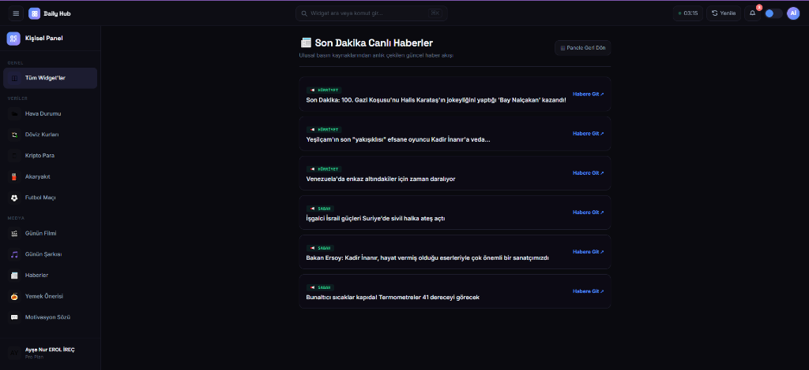

# 💻 ApiProjects - Modern Dashboard Application

Bu proje, günlük ihtiyaç duyulabilecek çeşitli canlı verileri (hava durumu, döviz kurları, kripto para piyasası, akaryakıt fiyatları, futbol puan durumu, trend filmler, popüler müzikler, güncel haberler, yemek tarifleri ve günün sözü) tek bir şık arayüzde birleştiren modern bir **ASP.NET Core MVC** kontrol paneli (dashboard) uygulamasıdır.

---

## 📸 Ekran Görüntüleri

### 1. Ana Sayfa (Dashboard)
Tüm widget'ların bir arada bulunduğu, dinamik olarak açılıp kapatılabilen modern karanlık temalı ana panel.


### 2. Döviz Kurları
USD bazlı olarak çekilen ve Türk Lirası dahil 12 farklı ülkenin canlı kur takibini sağlayan detay sayfası.


### 3. Avrupa Akaryakıt Fiyat Endeksi
Türkiye ve Avrupa ülkelerine ait güncel benzin, motorin ve LPG litre fiyatlarının listelendiği detay sayfası.


### 4. Son Dakika Haberler
Ulusal haber kaynaklarından çekilen canlı ve anlık RSS haber akışı listesi.


### 5. Trend Filmler
TMDB API altyapısı kullanılarak vizyondaki ve trend listelerindeki popüler sinema filmleri.


---

## 🚀 Modüller ve Sayfa Detayları

Uygulama, her biri kendine ait denetleyiciye (Controller) ve arayüze (View) sahip 10 bağımsız modülden oluşmaktadır:

### 1. 🌤 Hava Durumu (`/Weather`)
*   **Kullanılan Servis:** Open-Meteo API (Açık kaynak, API anahtarı gerektirmez).
*   **İşlev:** İstanbul için 3 günlük hava durumu tahminlerini (sıcaklık, hissedilen sıcaklık, rüzgar hızı ve nem oranları) getirir. Hava durumu kodlarına göre dinamik emojiler ve Türkçe açıklamalar sunar.

### 2. 💱 Döviz Kurları (`/Currency`)
*   **Kullanılan Servis:** Open Exchange Rates API.
*   **İşlev:** Döviz bilgilerini USD tabanlı olarak çeker ve TRY, EUR, GBP, JPY, CHF, CAD, AUD, CNY, SAR, AED, NOK, SEK para birimlerinin anlık kurlarını listeler.

### 3. 🪙 Kripto Para (`/Crypto`)
*   **Kullanılan Servis:** CoinLore API.
*   **İşlev:** Piyasa değerine göre en popüler 20 kripto parayı listeler. Günlük fiyat değişim oranlarını artış/azalış yönüne göre dinamik renklerle (Yeşil/Kırmızı) gösterir.

### 4. ⛽ Akaryakıt Fiyatları (`/Fuel`)
*   **Kullanılan Servis:** Gas Price API (RapidAPI).
*   **İşlev:** Türkiye ve Avrupa ülkelerine ait güncel benzin, dizel ve LPG litre fiyatlarını listeler. API istek limitlerinin aşılması durumunda uygulamanın aksamaması için **yedek veri (fallback) mekanizması** içerir.

### 5. ⚽ Süper Lig Zirvesi (`/FootballMatch`)
*   **Kullanılan Servis:** Super Lig Standings API (RapidAPI).
*   **İşlev:** Süper Lig'in güncel puan durumunu, takımların galibiyet/mağlubiyet sayılarını ve puanlarını canlı olarak listeler.

### 6. 🎬 Günün Filmi (`/Movie`)
*   **Kullanılan Servis:** TMDB (The Movie Database) API.
*   **İşlev:** Vizyondaki en popüler trend filmleri afişleri, özetleri, çıkış tarihleri ve TMDB puanlarıyla birlikte listeler.

### 7. 🎵 Günün Şarkısı (`/Music`)
*   **Kullanılan Servis:** Deezer API.
*   **İşlev:** Küresel müzik listelerinin zirvesindeki şarkıları, albüm kapaklarını ve sanatçı detaylarını listeler.

### 8. 📰 Güncel Haberler (`/NewsItem`)
*   **Kullanılan Servis:** Hürriyet, Sabah ve NTV RSS Servisleri.
*   **İşlev:** Güvenilir haber kaynaklarından anlık XML verilerini çekip parse ederek kullanıcılara reklamsız ve temiz bir haber listesi sunar.

### 9. 🍳 Günün Tarifi (`/Recipe`)
*   **Kullanılan Servis:** TheMealDB API.
*   **İşlev:** Her gün için farklı bir dünya mutfağı yemeği, kategorisi, kökeni ve görselini içeren yemek tarifi önerisi sunar.

### 10. ✍️ Günün Sözü (`/Quote`)
*   **Kullanılan Servis:** ZenQuotes API.
*   **İşlev:** Motivasyonel ve ilham verici sözleri yazarları ile birlikte listeler.

---

## 🛠 Teknik Altyapı ve Mimarisi

*   **Verimli Veri İletişimi:** Harici API servisleriyle iletişim kurulurken .NET'in performanslı `IHttpClientFactory` yapısı kullanılmıştır.
*   **Önbellek Yönetimi (Caching):** API sağlayıcılarının istek sınırlarını (Rate Limit) aşmamak amacıyla `IMemoryCache` kullanılarak veriler bellekte önbelleğe alınmıştır. (Örneğin; döviz verileri 30 dakika, kripto verileri 10 dakika önbellekte tutulur).
*   **Güvenli Anahtar Yönetimi (Secrets):** RapidAPI ve TMDB gibi servislerin hassas API anahtarları kaynak kodların içerisinden tamamen arındırılmış, `appsettings.json` içerisine taşınmıştır. Bu dosyanın GitHub'a kaza ile yüklenmesini engellemek için `.gitignore` yapılandırması tamamlanmıştır.

---

## ⚙️ Kurulum ve Çalıştırma

### 1. Projeyi Klonlayın
```bash
git clone https://github.com/aysnrerl/ApiProjects.git
cd ApiProjects
```

### 2. API Anahtarlarını Yapılandırın
1. Projenin ana dizininde bulunan `appsettings.Example.json` dosyasının adını `appsettings.json` olarak değiştirin.
2. Dosya içerisindeki ilgili alanlara kendi API anahtarlarınızı yazın:

```json
{
  "ApiKeys": {
    "RapidApiKey": "SİZİN_RAPID_API_ANAHTARINIZ",
    "TmdbBearerToken": "SİZİN_TMDB_BEARER_TOKENİNİZ"
  }
}
```

### 3. Projeyi Derleyin ve Çalıştırın
```bash
dotnet restore
dotnet build
dotnet run --project ApiProjects/ApiProjects.csproj
```
Uygulama varsayılan olarak `http://localhost:5119` (veya `https://localhost:7075`) adresi üzerinden çalışmaya başlayacaktır.